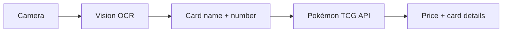

# Pokémon Card Scanner

An iOS app that uses your iPhone camera to scan Pokémon TCG cards and show estimated market value from TCGPlayer.

## How it works



1. Point your camera at a Pokémon card and tap the scan button.
2. Apple's **Vision** framework reads the card name and collector number (e.g. `025/165`) from the image.
3. The app queries the free **[Pokémon TCG API](https://pokemontcg.io/)** to find the card and fetch TCGPlayer market prices.
4. You see the card image, set info, and estimated value. If several cards match, you pick the right one.

A **manual search** option (toolbar) lets you type a card name when OCR struggles — useful in dim light or with holo glare.

## Requirements

- Mac with **Xcode 15+**
- iPhone running **iOS 17+** (camera required; Simulator has limited camera support)
- Free API key from [dev.pokemontcg.io](https://dev.pokemontcg.io) (recommended for reliable rate limits)

## Quick start

1. Open `PokemonCardScanner/PokemonCardScanner.xcodeproj` in Xcode.
2. Set your **Development Team** under Signing & Capabilities.
3. Add your API key in `PokemonCardScanner/Services/APIConfiguration.swift`:

   ```swift
   static let pokemonTCGAPIKey = "your-key-here"
   ```

4. Connect your iPhone, select it as the run destination, and press **Run** (⌘R).
5. Allow camera access when prompted.

## Project structure

| Path | Purpose |
|------|---------|
| `Views/ScannerView.swift` | Main camera UI and scan flow |
| `Views/CameraManager.swift` | AVFoundation capture session |
| `Services/CardRecognitionService.swift` | Vision text recognition + parsing |
| `Services/PokemonTCGService.swift` | API client for card search and prices |
| `Models/PokemonCard.swift` | Card and pricing models |

## Tips for better scans

- Use good, even lighting and avoid heavy glare on holo cards.
- Hold the phone steady and align the card inside the on-screen frame.
- Make sure the **card name** and **collector number** (bottom corner) are visible.

## Pricing disclaimer

Displayed prices are **TCGPlayer market estimates** from the Pokémon TCG API. Actual sale value depends on condition (NM/LP/MP), grading (PSA/BGS/CGC), language, and current demand. This app is for informational use, not financial advice.

## Future improvements

- On-device Core ML model for visual card matching (more accurate than OCR alone)
- Barcode / QR scanning where present on products
- Price history charts and collection tracking
- Graded card price tiers (PSA 10, etc.) via a paid pricing API

## License

MIT — use and modify freely for personal projects.
