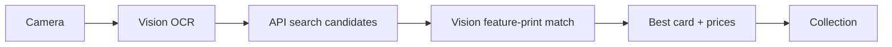

# Pokémon Card Scanner

An iOS app that uses your iPhone camera to scan Pokémon TCG cards, identify them with on-device visual matching, show raw and graded market values, and track your collection.

## Features

- **Camera scanning** with Vision OCR (card name + collector number)
- **Visual matching** using Apple Vision feature prints (on-device Core ML) to pick the right card when multiple share a name
- **Raw prices** from TCGPlayer via the [Pokémon TCG API](https://pokemontcg.io/)
- **Graded prices** (PSA, BGS, CGC) from recent eBay sold listings via [PkmnPrices](https://pkmnprices.com/)
- **Price history chart** (30d / 90d / 1 year)
- **Collection tracker** with portfolio total, quantities, and persistent storage (SwiftData)

## How it works



1. Point your camera at a Pokémon card and tap scan.
2. **Vision OCR** reads the card name and collector number.
3. The **Pokémon TCG API** returns candidate cards.
4. **Visual matching** compares your photo to each candidate's artwork and ranks by similarity %.
5. You see raw TCGPlayer price, graded eBay averages, price history, and can **add to collection**.

## Requirements

- Mac with **Xcode 15+**
- iPhone running **iOS 17+** (camera required)
- Free API key from [dev.pokemontcg.io](https://dev.pokemontcg.io) (card search + raw prices)
- Free API key from [pkmnprices.com](https://pkmnprices.com/) (graded prices + history — 100 credits/day)

## Quick start

1. Open `PokemonCardScanner/PokemonCardScanner.xcodeproj` in Xcode.
2. Set your **Development Team** under Signing & Capabilities.
3. Add API keys in `PokemonCardScanner/Services/APIConfiguration.swift`:

   ```swift
   static let pokemonTCGAPIKey = "your-pokemontcg-key"
   static let pkmnPricesAPIKey = "pk_your-pkmnprices-key"
   ```

4. Connect your iPhone and press **Run** (⌘R).

## Project structure

| Path | Purpose |
|------|---------|
| `Services/VisualMatchingService.swift` | On-device artwork similarity ranking |
| `Services/PkmnPricesService.swift` | Graded prices + price history |
| `Services/CardRecognitionService.swift` | Vision OCR |
| `Views/CollectionView.swift` | Portfolio tracker tab |
| `Views/GradedPricesSection.swift` | PSA/BGS/CGC price tiers |
| `Views/PriceHistoryChartView.swift` | Swift Charts price trend |
| `Models/CollectedCard.swift` | SwiftData collection model |

## Tips for better scans

- Use even lighting; avoid holo glare.
- Align the card inside the on-screen frame for best visual matching.
- If multiple matches appear, pick the one with the highest **% match**.

## Pricing disclaimer

Raw prices are TCGPlayer market estimates. Graded prices are averages of recent eBay sold listings. Actual value depends on condition, grading subgrades, and market timing. Informational use only — not financial advice.

## License

MIT — use and modify freely for personal projects.
